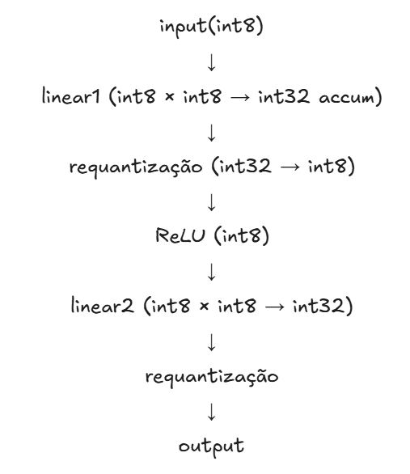

## Explicando o exemplo

Para entender a matemática da quantização em uma rede neural, eu criei uma Multi-Layer Perceptron (MLP). O objetivo é detalhar o fluxo de um dado desde a entrada até a saída, mostrando onde e como as operações de quantização e dequantização ocorrem.

Considere uma MLP com uma camada oculta e uma camada de saída conforme abaixo:

```python
class MLP(nn.Module):
    def __init__(self, input_dim, hidden_dim, output_dim):
        super().__init__()
        self.linear1 = nn.Linear(input_dim, hidden_dim)
        self.relu = nn.ReLU()
        self.linear2 = nn.Linear(hidden_dim, output_dim)

    def forward(self, x):
        x = self.linear1(x)
        x = self.relu(x)
        x = self.linear2(x)
        return x
```

A parte mais importante aqui serão os parâmetros dessa rede. Eles definem a "forma" da nossa rede neural, determinando quantos neurônios existem em cada etapa do processamento. Para que o experimento funcione, eles precisam ser consistentes entre a criação do modelo, os pesos quantizados e os dados de entrada.

1. `input_dim = 3072` (Dimensão de Entrada)

Representa o número de características (*features*) que cada amostra do seu dado possui. Este valor define o tamanho do tensor $X_{FP32}$ que entra no `QuantStub`. Se passarmos um dado com um tamanho diferente do esperado, o PyTorch retornará um erro de correspondência de matriz. O parâmetro de escala $S_X$ e o ponto zero $Z_X$ serão calculados especificamente para cobrir a distribuição desses valores de entrada.

2. `hidden_dim = 512` (Camada Oculta)

É a quantidade de neurônios na camada interna (`linear1`). Os pesos $W_{1,INT8}$ serão uma matriz de $20 \times 10$. A ativação ReLU ($A_{INT8}$) terá 20 valores inteiros. Este é o ponto onde a maior parte do ganho de performance ocorre, pois teremos $10 \times 20 = 200$ operações de multiplicação e acumulação (MAC) sendo feitas puramente em **INT32** antes de serem convertidas de volta para **INT8**.

3. `output_dim = 10` (Dimensão de Saída)
O número de neurônios na camada final (`linear2`), geralmente correspondendo ao número de classes em um problema de classificação. Os pesos $W_{2,INT8}$ serão uma matriz de $2 \times 20$. O resultado final $Y_{2,INT8}$ passa pelo `DeQuantStub` para voltar a ser um par de números em ponto flutuante ($Y_{FP32}$), permitindo que você leia as probabilidades ou scores finais.

As operações em ponto flutuante (FP32) seriam:

**Entrada**:

$X_{FP32} \in \mathbb{R}^{N \times D_{in}}$
- $N$: tamanho do batch
- $D_{in}$: dimensão de entrada

**Primeira Camada Linear (Oculta)**:

$H_{FP32} = X_{FP32} W_1^{T} + B_1$
    
- $W_1 \in \mathbb{R}^{D_{out1} \times D_{in}}$: pesos
- $B_1 \in \mathbb{R}^{D_{out1}}$: bias

**Função de Ativação (ReLU)**:
    
$A_{FP32} = \text{ReLU}(H_{FP32}) = \max(0, H_{FP32})$

**Segunda Camada Linear (Saída)**:

$Y_{FP32} = A_{FP32} W_2^{T} + B_2$

- $W_2 \in \mathbb{R}^{D_{out2} \times D_{out1}}$: pesos
- $B_2 \in \mathbb{R}^{D_{out2}}$: bias

Lembrando que a relação entre um valor de ponto flutuante $r$ e seu valor quantizado $q$ é dada por:

$$ r = S \cdot (q - Z) \quad \text{ou} \quad q = \text{round}\left(\frac{r}{S}\right) + Z $$

Onde $S$ é a escala e $Z$ é o ponto zero. Para quantização INT8, $q$ geralmente varia de $0$ a $255$ (para UINT8) ou de $-128$ a $127$ (para INT8 assinado).

Considerando a estratégia de PTQ para quantizar a MLP, inserimos `QuantStub` e `DeQuantStub` e usamos observadores para estimar os parâmetros $S$ e $Z$ para cada tensor de ativação e peso. O modelo quantizado teria a seguinte estrutura conceitual:

```python
class QuantizedMLP(nn.Module):
    def __init__(self, input_dim, hidden_dim, output_dim):
        super().__init__()
        self.quant = torch.quantization.QuantStub()
        self.linear1 = nn.Linear(input_dim, hidden_dim)
        self.relu = nn.ReLU()
        self.linear2 = nn.Linear(hidden_dim, output_dim)
        self.dequant = torch.quantization.DeQuantStub()

    def forward(self, x):
        x = self.quant(x)
        x = self.linear1(x)
        x = self.relu(x)
        x = self.linear2(x)
        x = self.dequant(x)
        return x
```

Durante a fase de `prepare`, observadores (e.g., `MinMaxObserver`) são inseridos automaticamente após cada operação quantizável para coletar estatísticas. Após a calibração, a função `convert` substitui as camadas FP32 por suas versões quantizadas (e.g., `nn.quantized.Linear`) e insere as operações de quantização/dequantização necessárias.

Vamos seguir um tensor de entrada $X_{FP32}$ através da MLP quantizada.

#### Quantização da Entrada ($X_{FP32} \rightarrow X_{INT8}$)

Quando a entrada $X_{FP32}$ chega ao `self.quant` (um `QuantStub`), ela é quantizada para um tensor de inteiros $X_{INT8}$. Os parâmetros de quantização $S_X$ e $Z_X$ são determinados durante a calibração a partir da distribuição de $X_{FP32}$.

$$ X_{INT8} = \text{round}\left(\frac{X_{FP32}}{S_X}\right) + Z_X $$

#### Primeira Camada Linear Quantizada (`self.linear1`)

Esta camada realiza a operação $H_{FP32} = X_{FP32} W_1^{T} + B_1$. No domínio quantizado, isso se torna uma operação de multiplicação de matrizes e adição de bias com inteiros.

1. Pesos Quantizados: 

Os pesos $W_{1,FP32}$ são quantizados para $W_{1,INT8}$ com seus próprios parâmetros $S_{W1}$ e $Z_{W1}$.

$$W_{1,INT8} = \text{round}\left(\frac{W_{1,FP32}}{S_{W1}}\right) + Z_{W1}$$

2. Bias Quantizado: 

O bias $B_{1,FP32}$ é quantizado para um inteiro de 32 bits $B_{1,INT32}$. A escala para o bias é tipicamente o produto das escalas da entrada e dos pesos ($S_X S_{W1}$), para que possa ser adicionado diretamente ao resultado da multiplicação de inteiros.

$$B_{1,INT32} = \text{round}\left(\frac{B_{1,FP32}}{S_X S_{W1}}\right)$$

3. Operação de Multiplicação e Acumulação (MAC): 

A operação central é realizada com inteiros. Para cada elemento da saída $H_{INT32}$, a soma dos produtos é calculada:

$$H_{1,INT32} = \sum_{k} (X_{INT8,k} - Z_X) \cdot (W_{1,INT8,k} - Z_{W1}) + B_{1,INT32}$$

Note que os pontos zero são subtraídos antes da multiplicação para alinhar os intervalos, e o resultado é acumulado em INT32 para evitar overflow e preservar a precisão intermediária.

4. Re-quantização da Saída da Camada Linear:

O resultado $H_{1,INT32}$ é então re-quantizado para um formato INT8 ($H_{1,INT8}$) usando os parâmetros de escala $S_{H1}$ e ponto zero $Z_{H1}$ que foram determinados para a saída desta camada durante a calibração.

$$H_{1,INT8} = \text{round}\left(\frac{H_{1,INT32} \cdot S_X S_{W1}}{S_{H1}}\right) + Z_{H1}$$

Esta etapa é crucial para que o resultado possa ser passado para a próxima operação em INT8.

#### Função de Ativação Quantizada (`self.relu`)

A função ReLU é aplicada ao tensor $H_{1,INT8}$. Como $\text{ReLU}(x) = \max(0, x)$, esta operação é relativamente simples no domínio de inteiros. Se o ponto zero $Z_{H1}$ for zero (quantização simétrica) ou se o intervalo de $H_{1,INT8}$ for não-negativo, a operação pode ser aplicada diretamente:

$$ A_{INT8} = \max(Z_{H1}, H_{1,INT8}) $$

Em alguns casos, pode haver uma re-quantização após a ReLU se a distribuição de saída mudar significativamente, mas para ReLU simples, muitas vezes os parâmetros de quantização da entrada são reutilizados para a saída, ou a operação é fundida (fused) com a camada linear anterior.

#### Segunda Camada Linear Quantizada (`self.linear2`)

Similar à primeira camada linear, a segunda camada opera em inteiros:

1. Pesos Quantizados: 

Os pesos $W_{2,FP32}$ são quantizados para $W_{2,INT8}$ com $S_{W2}$ e $Z_{W2}$.

$$W_{2,INT8} = \text{round}\left(\frac{W_{2,FP32}}{S_{W2}}\right) + Z_{W2}$$

2. Bias Quantizado:

Os bias $B_{2,FP32}$ são quantizados para $B_{2,INT32}$ usando a escala $S_{A} S_{W2}$ 
- $S_A$: escala da ativação $A_{INT8}$

Lembrando que, se a ReLU não mudou a escala, $S_A = S_{H1}$.

$$B_{2,INT32} = \text{round}\left(\frac{B_{2,FP32}}{S_A S_{W2}}\right) $$

3. Operação de Multiplicação e Acumulação (MAC):
    
$$Y_{2,INT32} = \sum_{k} (A_{INT8,k} - Z_A) \cdot (W_{2,INT8,k} - Z_{W2}) + B_{2,INT32}$$

4. Re-quantização da Saída da Camada Linear: 

O resultado $Y_{2,INT32}$ é re-quantizado para $Y_{2,INT8}$ usando os parâmetros $S_{Y2}$ e $Z_{Y2}$ da saída final da rede (antes da dequantização).

$$Y_{2,INT8} = \text{round}\left(\frac{Y_{2,INT32} \cdot S_A S_{W2}}{S_{Y2}}\right) + Z_{Y2}$$

#### Dequantização da Saída (`self.dequant`)

O `self.dequant` (um `DeQuantStub`) converte a saída final quantizada $Y_{2,INT8}$ de volta para ponto flutuante $Y_{FP32}$ para uso posterior (e.g., cálculo de perda, inferência final).

$$Y_{FP32} = S_{Y2} \cdot (Y_{2,INT8} - Z_{Y2})$$

Cada camada quantizável (como `nn.Linear`) é substituída por uma versão que encapsula essas operações de inteiros, incluindo a re-quantização interna. Os observadores são cruciais para determinar os $S$ e $Z$ corretos para cada tensor de ativação e peso, garantindo que a informação seja preservada ao máximo durante as conversões de precisão. Este processo permite que a rede execute a maior parte de suas computações usando aritmética de inteiros de baixa precisão, resultando em ganhos significativos de velocidade e redução de memória, com uma perda mínima de acurácia.



## O modelo é "Integer Only"?

Um modelo é considerado 'integer-only' quando todas as suas operações computacionais (multiplicações, adições, ativações, etc.) são realizadas usando aritmética de inteiros de baixa precisão. Isso significa que não há conversões intermediárias para ponto flutuante durante a inferência. O fluxo de dados é puramente de inteiros do início ao fim do modelo.

O backend `fbgemm` do PyTorch (para CPUs) e o `TensorRT` da NVIDIA são capazes de executar modelos de forma totalmente quantizada para certas arquiteturas e operações.

A quantização híbrida (simulada/mixed-precision) é uma abordagem mais comum e flexível, especialmente durante o processo de desenvolvimento e calibração. Neste cenário, algumas operações são realizadas em inteiros, mas conversões intermediárias ainda podem ocorrer em ponto flutuante.

Embora isso possa parecer flexível, já que permite quantizar apenas as partes mais intensivas computacionalmente do modelo, mantendo outras partes em FP32 para preservar a acurácia ou simplificar a implementação, não funcionria em hardware embarcado que não possui suporte para FP32.

Com base na estrutura do exemplo, dá para perceber que é um exemplo de quantização 'híbrida'. O PyTorch adota a abordagem híbrida por padrão em PTQ por várias razões:

- Facilidade de Uso: Simplifica a integração com o ecossistema PyTorch existente, onde muitas operações e o treinamento são em FP32.

- Compatibilidade: Garante que o modelo possa interagir com outras partes do código que esperam entradas/saídas em FP32.

- Acurácia: Minimiza a perda de acurácia ao permitir que operações sensíveis (ou não otimizadas para inteiros) permaneçam em FP32 ou sejam dequantizadas temporariamente.

- Backends: A capacidade de executar um modelo de forma totalmente 'integer-only' depende do backend de quantização (e.g., fbgemm, qnnpack) e do hardware subjacente. O PyTorch tenta otimizar para o backend disponível, mas a estrutura com QuantStub/DeQuantStub é a representação padrão para a quantização simulada.

Para obter um modelo verdadeiramente 'integer-only' no PyTorch, você precisaria garantir que:

1. Todas as operações são suportadas: Cada operação no seu grafo computacional tem uma implementação otimizada para inteiros no backend de quantização escolhido.

2. Fusão de Operações: Operações como Conv + ReLU ou Linear + ReLU são fundidas em uma única operação quantizada para evitar dequantizações intermediárias.

3. Remoção de DeQuantStub: A DeQuantStub final seria removida ou posicionada apenas no ponto onde a saída precisa ser consumida por um sistema que espera FP32. Para inferência puramente em hardware de inteiros, a saída pode permanecer em INT8.

## Ideia do Rafael

Utilizar quantizações diferentes para cada camada. Possível? Sim. Já estudado e implementado em alguns artigos.

Então eu acho que temos um somatório de técnicas:
- Fusion Layer
- Mixed-precision
- Early-Exit

Problemática: Não temos frameworks para trabalhar com isso
