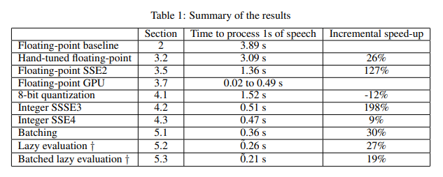
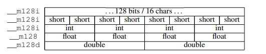
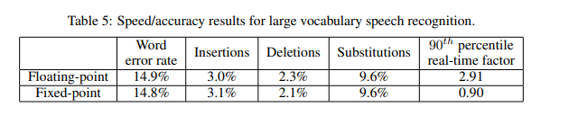

# Improving the speed of neural networks on CPUs

## Abstract

Recent advances in deep learning have made the use of large, deep neural networks with tens of millions of parameters suitable for a number of applications that require real-time processing. The sheer size of these networks can represent a challenging computational burden, even for modern CPUs. For this reason, GPUs are routinely used instead to train and run such networks. This paper is a tutorial for students and researchers on some of the techniques that can be used to reduce this computational cost considerably on modern x86 CPUs. We emphasize data layout, batching of the computation, the use of SSE2 instructions, and particularly leverage SSSE3 and SSE4 fixed-point instructions which provide a 3× improvement over an optimized floating-point baseline. We use speech recognition as an example task, and show that a real-time hybrid hidden Markov model/neural network (HMM/NN) large vocabulary system can be built with a 10× speedup over an unoptimized baseline and a 4× speedup over an aggressively optimized floating-point baseline at no cost in accuracy. The techniques described extend readily to neural network training and provide an effective alternative to the use of specialized hardware.

## Introduction

The recent resurgence of interest in neural networks owes a certain debt to the availability of affordable, powerful GPUs which routinely speed up common operations such as large matrix computations by factors from $5\times$ to $50\times$ [1-3]. These enabled researchers to tackle much larger, more difficult machine learning tasks using neural networks, auto-encoders or deep belief networks [4-6]. Due to a variety of factors, including cost, component reliability and programming complexity, GPUs are still however the exception rather than the norm in computing clusters. The question then becomes whether to invest in GPU resources, or whether traditional CPUs can be made to perform fast enough that, using distributed computing, they will yield similar or superior scalability and performance. The purpose of this paper is not to settle this debate, but rather to introduce to neural network researchers some tools which can significantly improve the performance of neural networks on Intel and AMD CPUs in accessible form. Some of these might not be novel to researchers well versed in high-performance computing, but they lay the foundation for improvements going beyond what one might obtain using existing optimized BLAS packages. We will show in particular how one can outperform optimized BLAS packages by a factor of 3 using fixed point arithmetic and SSSE3 / SSE4 instructions.

To illustrate the argument, we will use a neural network achieving state-of-the-art performance on the task of speech recognition for mobile voice input. The basic benchmark setup is described in detail in Section 2, while the full speech recognition evaluation system is described in 6. Section 3 will cover the basics of data layout and floating-point SIMD operations. Section 4 describes the fixed-point implementation of some of the matrix operations. Section 5 introduces further enhancements that are more specifically applicable to the speech recognition task. We’ll conclude in Section 6 with performance results on the end-to-end system.

## Benchmark setup

In the following, we will use as a benchmark a neural network with 5 layers. The input layer has 440 inputs consisting of 11 consecutive, overlapping 25 ms frames of speech, sampled every 10 ms. Each frame consists of 40 log-energies extracted from filterbanks on a Mel frequency scale. Each layer but the last uses a sigmoid as non-linearity. Each intermediate layer consists of 2000 nodes, and the final softmax layer has 7969 outputs which correspond to log-posteriors for contextdependent acoustic states of a HMM/NN speech recognizer. During decoding the softmax output is not normalized. Details of the HMM/NN system can be found in [7] and in Section 6.

The evaluation setup consists of running 100 frames of data through the network on a single CPU on an Intel Xeon DP Quad Core E5640 machine with Ubuntu OS. CPU scaling was disabled and each run was performed a minimum of 5 times and averaged. A summary of the results is presented in Table 1. For results relating to lazy evaluation (†), Table 1 reports performance assuming 30% of the neural network outputs actually need to be computed (see Section 5 for details).



## Floating-point implementation

### Memory locality

The most basic tenet of high-performance computing is that once you touch a given memory address, nearby memory past this address gets loaded into the various caches that live on the processor die. This makes the nearby data available to the CPU much faster than it would be if it had to fetch it from memory. The most immediate consequence is that one should strive to have the innermost loops of any numerical computation walk contiguous memory. As an example, consider the multiplication of matrix $A = [a_i,j ]$ and $B = [b_k,l]$. Each entry of matrix $C = AB = [c_i,l]$ is:

$$c_{i,j} = \sum \limits_{m} a_{i,m}b_{m, l}$$

Since the loop variable m walks the columns of A and rows of B, A is best stored in row-major order, while B is best stored in column-major order. This is even more important when taking Single Instruction, Multiple Data (SIMD) instructions into account.

### Loop unrolling and parallel accumulators

There are several well-known ways to improve over a naive implementation of matrix multiplication. The innermost loop of the matrix multiply operation is a multiply-and-add operation:
$c += a[i]*b[i]$. To reduce the overhead of checking for loop termination, one can partially
unroll the computation by accumulating multiple elements at a time:

$$c += a[i]*b[i] + a[i+1]*b[i+1] + a[i+2]*b[i+2] + a[i+3]*b[i+3]$$

A second technique is to use multiple accumulators in parallel, which gives the compiler more freedom in pipelining operations and distributing them across floating-point units:

c0 += a[i]*b[i];
c1 += a[i+1]*b[i+1];
c2 += a[i+2]*b[i+2];
c3 += a[i+3]*b[i+3];
c = c0 + c1 + c2 + c3;

On our example benchmark (Table 1), unrolling loops in blocks of 8 and using 4 accumulators in
parallel yields a 26% speed improvement.

### SIMD

SIMD instructions are the fundamental building blocks of low-level parallelization on CPUs. These
instructions perform multiple operations in parallel on contiguous data, making the issues of data
locality even more critical. On Intel and AMD CPUs of the x86 family, they typically operate on 16
bytes worth of data at a time: 2 doubles, 4 floats, 8 shorts or 16 bytes at a time. Various datatypes are defined to represent these, __m128i, __m128 and __m128d:



Fundamental operations on these datatypes use assembly instructions, but are more easily incorporated into C and C++ using thin wrapper functions called intrinsics [8], available for the
most popular C and C++ compilers. As an example, if you have two vectors of 4 floats stored
in two variables a = [a1, a2, a3, a4] and b = [b1, b2, b3, b4] of type __m128, you can obtain
c = [a1 + b1, a2 + b2, a3 + b3, a4 + b4] by writing in C:
#include <mmintrin.h>
__m128 c = _mm_add_ps(a, b);

### Data layout optimization for SIMD

There are 2 main difficulties in laying out data optimally to leverage SIMD instructions.

First, SIMD instructions generally operate faster on 16 byte blocks that are 16-byte aligned in memory. Being ‘16-byte aligned’ means that the memory address of the first byte is a multiple of 16. As a consequence, if an array of data to be processed is not aligned to 16 bytes, performance will suffer greatly. Forcing 16-byte alignment of a memory block can be achieved in C by replacing calls to `malloc()` with `posix_memalign()`, or by using custom allocators if using the Standard Template Library.

Second, since every instruction operates on a block of 16 bytes, if a data vector is not a multiple of 16 bytes in size, one will have to deal with edge effects. The simplest solution is zero-padding: treat every vector of size $N$ as a vector of size $((N + 15)/16) ∗ 16$ (integer arithmetic), with added zeros at the end. For most linear operations, such as scalar product, sum, matrix multiply, the embedding into such larger vector space is invariant and does not affect the results.

In the following, we’ll assume every vector and row (resp. column) in row-major (resp. columnmajor) matrix is aligned and zero-padded.

###  Floating-point SIMD and Intel SSE2

Intel and AMD processors that support SSE2 provide the basic instructions to perform the multiplyand-add step using floating-point SIMD arithmetic: *_mm_add_ps()* and *_mm_mul_ps()*. Here is a simplified example accumulating the scalar product of *__m128* *a and *__m128 *b* to
*__m128* sum:

```text
// c[0] = a[0]*b[0], ... , c[3] = a[3]*b[3]
__m128 c = _mm_mul_ps(*a, *b);
// sum[0] += c[0], ..., sum[3] += c[3]
sum = _mm_add_ps(c, sum);
```

*sum* now contains 4 partial sums which have to be added horizontally to yield the final result using a mechanism such as shuffle instructions available with SSE2, or horizontal sums
(*_mm_hadd_ps()*) available with SSE3. Most modern compilers are able to leverage SIMD instructions automatically to some extent. However, it is our experience that automatic vectorization does not come close to realizing the performance gains one can achieve by writing code that leverages them explicitly.

### Comparison to optimized BLAS package

As an illustration of how these simple techniques fare in comparison to off-the-shelf fast matrix libraries, we compared the matrix multiplications in our benchmark with Eigen [9]. Eigen is a very fast library which pays particular attention to cache optimization.


## Further task-specific improvements

### Batching

### Lazy evaluation

### Batched lazy evaluation

## Speech recognition evaluation

Table 1 shows that, for the neural network computation, the speed improvements are in the vicinity of $10\times$ against a naive baseline, and around $4\times$ against our best floating-point system. We now evaluate our best floating-point and fixed-point systems in the context of a real speech recognition task, with the overhead of the decoder and the cost of real-task memory access patterns that it entails.

The end-to-end system consists of a hidden Markov model, context-dependent speech recognizer. The neural network described in Section 2 provides posterior probabilities for each state, which are then divided by state priors to yield observation likelihoods. The evaluation task consists of 27400 utterances of mobile spoken input such as search queries and short messages, and uses a large N-gram language model tuned to that combination of tasks. The search is performed using a weighted finite-state transducer decoder [12]. The evaluation was conducted on a cluster of machines replicating a real production environment, and was tuned to typical production parameters.



Table 5 shows that no performance cost is incurred by quantizing the neural network parameters, but the end-to-end system runs $3\times$ faster and within real-time constraints. The real-time factor quoted is the $90^{th}$ percentile across all utterances of the ratio of time spent decoding an utterance to the duration of the utterance.

## Conclusion

Optimization of the kind of large matrix computations that are needed to evaluate neural networks on a CPU is a complex topic in an ever-evolving ecosystem of architectures and performance tradeoffs. This paper shows that simple techniques can dramatically enhance the performance of neural network-based systems. Of particular interest are recently-introduced fixed-point SIMD operations in x86 processors which once again tilt the balance of performance in favor of fixed-point arithmetic. We showed that leveraging these faster instructions, a real-time speech recognizer can be built using a very large hybrid network at no cost in accuracy.